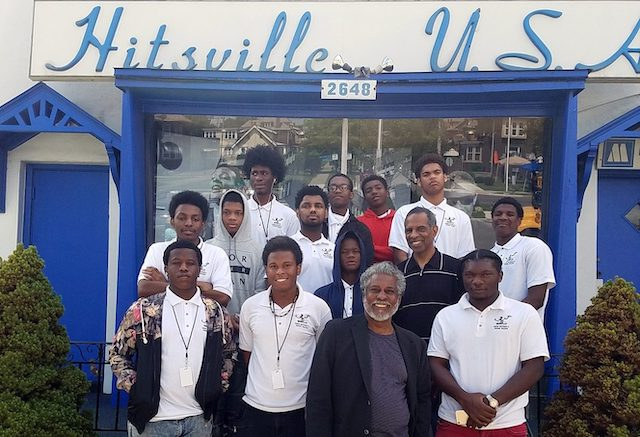
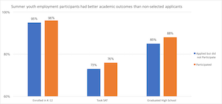

## Job Market Paper

The Causal Effects of Foster Care on Child Outcomes  

## Working Papers

The Effect of Course Shutouts on Community College Students: Evidence from Waitlist Cutoffs  (with Silvia Robles, Robert Fairlie, and Thomas Barrios) 

[**The Effect of Summer Employment on the Educational Attainment of Under-Resourced Youth**](https://max-gross.github.io/website_documents/detroit_summer_employment.pdf) (with Brian A. Jacob and Kelly Lovett) 

  |  
 :---: | :---:

Summer youth employment programs are a popular way for municipalities to provide
adolescents with skills and experiences thought to improve labor market outcomes.
While research evidence on such programs has grown in recent years, it is still limited.
In particular, it is not clear how, if at all, participation influences key educational
outcomes. We study the program in Detroit, Michigan using a selection on observables
identification strategy. In addition to controlling for a rich set of covariates, including
baseline educational measures, we match participants to their classmates of the same
race and gender who applied for the program, but did not participate. We find
that participation is associated with a modest increase in educational attainment.
Specifically, it increased the likelihood of enrolling in public school after the program
by 1.5% and of graduating high school by 4%, relative to comparison means of 94.5%
and 85%. Youth with the weakest academic skills benefited the most, as participation
increased school enrollment by 2.2% and high school graduation by 5.5% for this group.
Falsification tests of whether participation predicts pre-program characteristics as well
as bounding exercises to account for omitted variables offer support that our results represent true effects of the program and not selection.
* [Public Policy Brief](https://max-gross.github.io/website_documents/detroit_summer_employment_brief.pdf)
* Press Coverage: [CBS Detroit](https://detroit.cbslocal.com/2018/04/11/youth-in-detroit-summer-jobs-program-gain-more-than-a-paycheck/), [Crain's Detroit Business](https://www.crainsdetroit.com/article/20180411/news/657856/um-study-detroit-youth-jobs-program-shows-educational-benefits), [Michigan Radio NPR](https://www.michiganradio.org/post/detroit-youth-summer-jobs-program-boosts-graduation-rates-lowers-absences)

## Publications

[**Early Exposure to Child Maltreatment and Academic Outcomes**](https://max-gross.github.io/website_documents/child_maltreatment_academic_outcomes.pdf) (with Joseph P. Ryan, Brian A. Jacob, Andrew Moore, Brian E. Perron, and Sharlyn Ferguson)  
**Child Maltreatment.** July 2018.  

This study investigates the prevalence of early contact with child protection services (CPS) and determines whether early exposure to maltreatment investigations is associated with academic outcomes. Using administrative data from Michigan of over 700,000 children across seven birth cohorts, we find that 18% of students were the subject of a formal CPS investigation between birth and the third grade. In some school districts, more than 50% of third graders were the subject of an investigation. African American and poor students were more likely to be investigated for maltreatment than other groups. Children associated with maltreatment investigations scored significantly lower on standardized math and reading tests, were more likely to be identified as needing special education, and were more likely to be held back at least one grade. These findings indicate that involvement with CPS is not an infrequent event in the lives of young children and that within some school districts, maltreatment investigations are the norm. Child welfare and educational systems must collaborate so that the early academic struggles experienced by victims of maltreatment do not mature into more complicated difficulties later in life.

